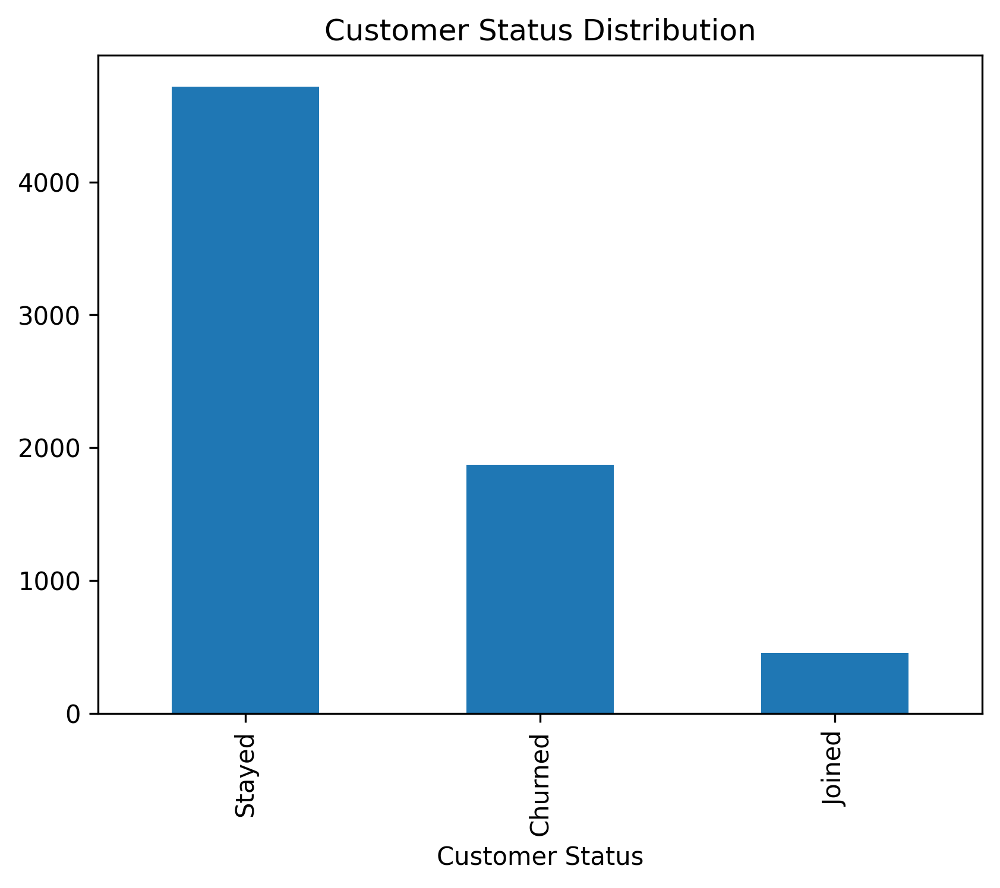
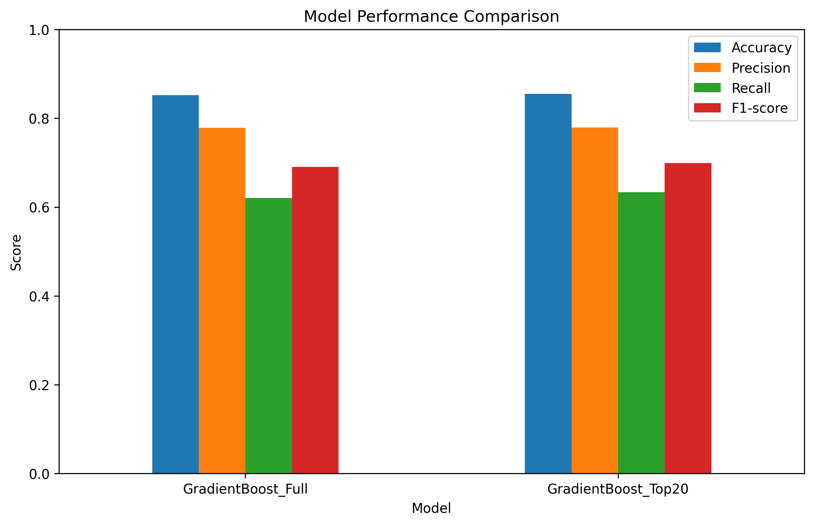

# Customer Churn Prediction

Dự án Machine Learning dự đoán khả năng khách hàng rời bỏ dịch vụ (Customer Churn Prediction) bằng Python, Scikit-learn và Flask.

---

# Tổng quan dự án

Dự án tập trung phân tích hành vi khách hàng nhằm:

- Xác định nhóm khách hàng có nguy cơ rời bỏ dịch vụ
- Phân tích các yếu tố ảnh hưởng đến churn
- Xây dựng mô hình Machine Learning dự đoán churn
- Hỗ trợ doanh nghiệp cải thiện tỷ lệ giữ chân khách hàng

Dự án bao gồm:

- Data Cleaning
- Exploratory Data Analysis (EDA)
- Feature Engineering
- Machine Learning
- Model Evaluation
- Flask Web Application

---

# Công nghệ sử dụng

- Python
- Pandas
- NumPy
- Matplotlib
- Seaborn
- Scikit-learn
- Flask
- Jupyter Notebook

---

# Dataset

Dataset chứa thông tin khách hàng như:

- Giới tính
- Loại hợp đồng
- Internet service
- Monthly charges
- Total charges
- Tenure
- Customer status

Biến mục tiêu:

- Customer Status (Stayed / Churned)

---

# Phân tích dữ liệu (EDA)

## Phân bố trạng thái khách hàng



---

## Mối quan hệ giữa loại hợp đồng và churn


---

## Monthly Charges vs Churn


---

## Feature Importance


---

# Machine Learning Models

Các mô hình được thử nghiệm:

- Logistic Regression
- Random Forest
- Gradient Boosting

Mô hình cuối cùng được chọn:

- Gradient Boosting Classifier

---

# Kết quả mô hình

| Model | Accuracy | Precision | Recall | F1-score |
|---|---|---|---|---|
| GradientBoost_Full | 0.852 | 0.779 | 0.620 | 0.690 |
| GradientBoost_Top20 | 0.855 | 0.779 | 0.633 | 0.699 |

---

## So sánh hiệu suất mô hình



---

## Confusion Matrix


---

# Cấu trúc project

```text
churn/
├── app/
├── data/
├── images/
├── model/
├── notebook/
├── README.md
├── requirements.txt
└── .gitignore