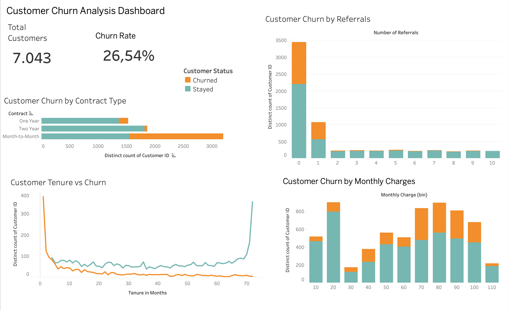
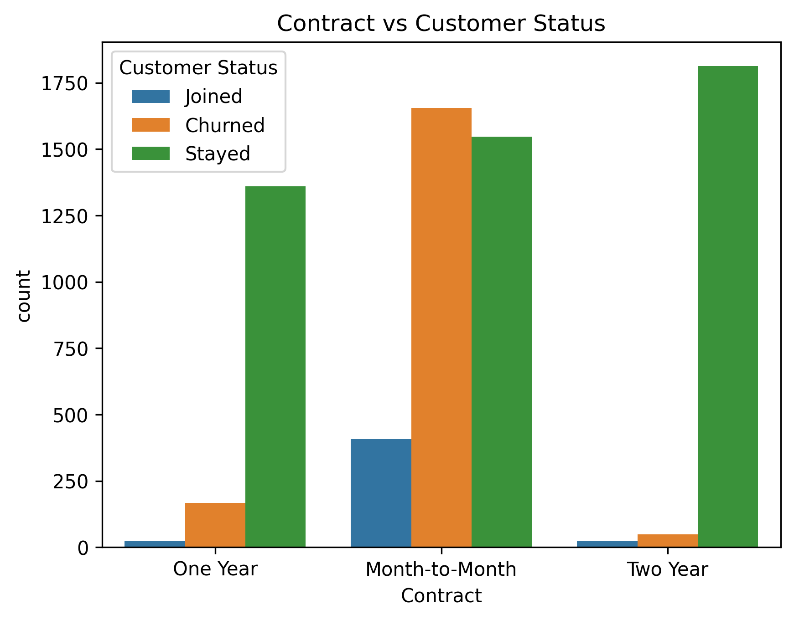
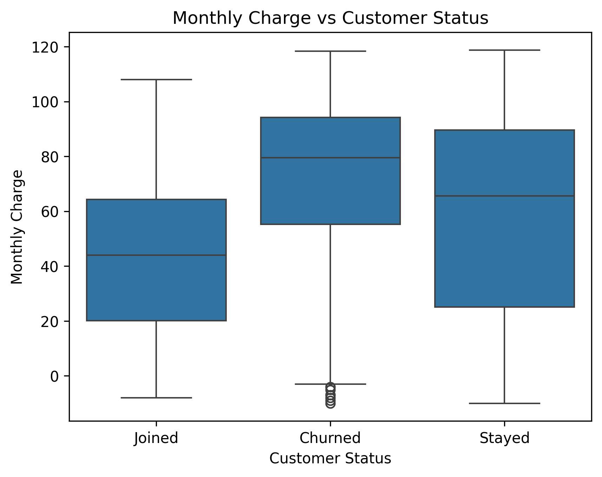
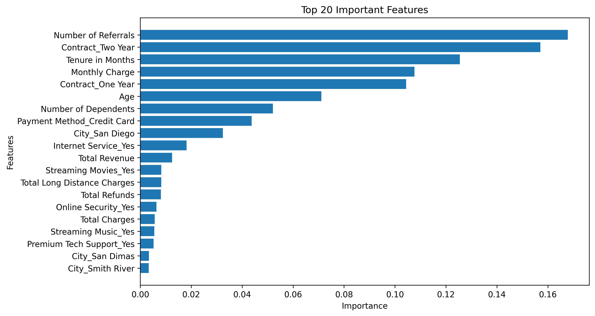
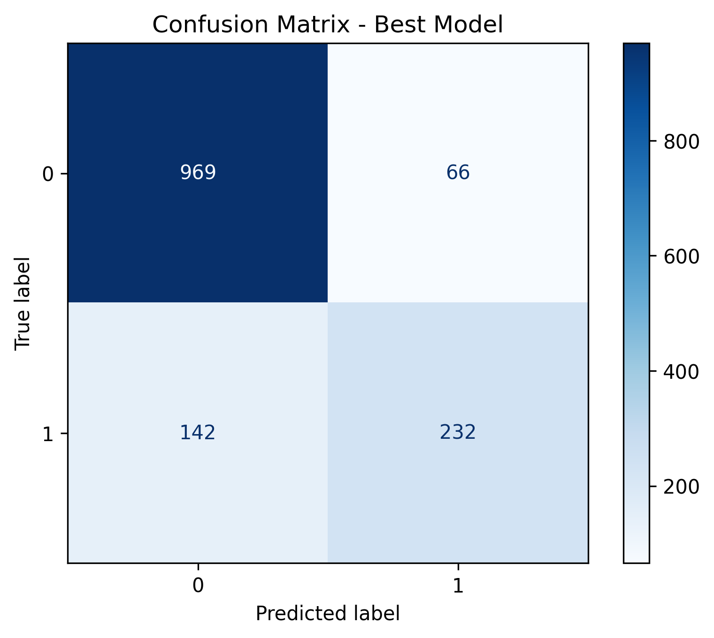

# Customer Churn Analysis & Prediction

Customer Churn Analysis and Prediction project using Python, Machine Learning, and Tableau to identify customer behaviors related to churn and support customer retention strategies.

---

# Project Overview

This project focuses on analyzing customer behavior and predicting the likelihood of customer churn in a telecom service business.

The objectives of the project are:

- Analyze customer churn patterns
- Identify important factors affecting churn behavior
- Build and evaluate Machine Learning models
- Visualize business insights through an interactive Tableau dashboard
- Support data-driven customer retention decisions

---

# Technologies Used

- Python
- Pandas
- NumPy
- Matplotlib
- Scikit-learn
- Flask
- Tableau Public
- Jupyter Notebook

---

# Project Workflow

## 1. Data Cleaning

- Handled missing values
- Removed inconsistent records
- Converted data types
- Prepared dataset for analysis

## 2. Exploratory Data Analysis (EDA)

Analyzed customer behavior patterns related to:

- Contract type
- Monthly charges
- Tenure
- Referrals
- Internet services

## 3. Feature Engineering

- Encoded categorical variables
- Selected important features
- Created ML-ready dataset

## 4. Machine Learning

Trained and evaluated multiple classification models:

- Logistic Regression
- Random Forest
- Gradient Boosting

Final selected model:

- Gradient Boosting Classifier

## 5. Dashboard Visualization

Built an interactive Tableau dashboard to visualize:

- Churn rate
- Contract type distribution
- Monthly charges vs churn
- Customer tenure behavior
- Referral impact on churn

---

# Dataset

The dataset includes customer information such as:

- Gender
- Contract Type
- Internet Service
- Monthly Charges
- Total Charges
- Tenure
- Referrals
- Customer Status

Target variable:

- Customer Status (Stayed / Churned)

---

# Tableau Dashboard

## Customer Churn Dashboard



---

# Exploratory Data Analysis

## Customer Churn by Contract Type



---

## Customer Tenure vs Churn


---

## Customer Churn by Monthly Charges



---

## Customer Churn by Referrals


---

# Feature Importance

The most influential features affecting churn prediction include:

- Number of Referrals
- Contract Type
- Tenure in Months
- Monthly Charges
- Age



---

# Model Performance

| Model | Accuracy | Precision | Recall | F1-score |
|---|---|---|---|---|
| GradientBoost_Full | 0.852 | 0.779 | 0.620 | 0.690 |
| GradientBoost_Top20 | 0.855 | 0.779 | 0.633 | 0.699 |

---

## Confusion Matrix



---

# Business Insights

Key findings from the analysis:

- Customers with Month-to-Month contracts showed significantly higher churn rates.
- Customers with longer tenure were more likely to stay.
- Higher monthly charges were associated with increased churn probability.
- Customers with more referrals tended to have stronger retention behavior.

---

# Project Structure

```text
churn/
├── app/
├── data/
├── images/
├── model/
├── notebook/
├── README.md
├── requirements.txt
└── .gitignore
```

---

# Future Improvements

- Deploy the model using Flask web application
- Add real-time prediction interface
- Improve dashboard interactivity
- Experiment with additional ML models